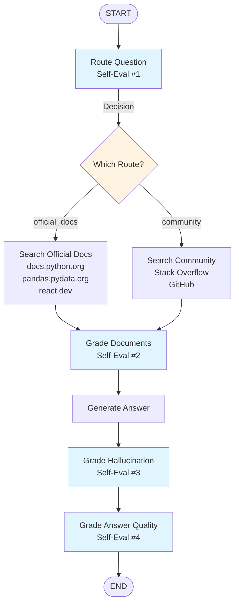

# Adaptive RAG - Technical Documentation Assistant

An intelligent **Retrieval-Augmented Generation (RAG)** system built with LangGraph that uses **self-evaluation** at multiple stages to provide accurate technical documentation answers. The system intelligently routes between official documentation and community solutions, then evaluates and validates its own responses.


## What is Adaptive RAG?

**Adaptive RAG** is a RAG approach where the LLM **evaluates itself at multiple stages**:

1. **Routes** questions to the right data source (official docs vs community)
2. **Grades** document relevance
3. **Generates** answers from filtered results
4. **Checks** for hallucinations (unverified information)
5. **Validates** answer quality

The key insight: **Adaptive RAG = Basic RAG + LLM Self-Evaluation Loops**

Instead of blindly trusting retrieval and generation, the system continuously evaluates and validates its own work.

## Architecture

### High-Level Flow

```
User Question
    ↓
[1] Route Evaluation (Self-Eval #1)
    ├─→ Official Docs Search
    └─→ Community Search
    ↓
[2] Document Relevance Evaluation (Self-Eval #2)
    ↓
[3] Answer Generation
    ↓
[4] Hallucination Check (Self-Eval #3)
    ↓
[5] Answer Quality Check (Self-Eval #4)
    ↓
Final Answer
```

### Detailed LangGraph Workflow



### Graph State

The workflow uses a shared state (`GraphState`) that flows through all nodes:

```python
class GraphState(TypedDict):
    question: str              # User's question
    route_decision: str         # "official_docs" or "community"
    documents: List             # Search results
    filtered_documents: List    # After relevance filtering
    generation: str             # Final answer
```

## Self-Evaluation Steps

### 1. Route Evaluation (Self-Eval #1)

**Purpose**: Decide where to search

**Node**: `route_question`

**Evaluation**:
- Analyzes question type
- Determines if it's an API/documentation question → `official_docs`
- Or an error/troubleshooting question → `community`

**Example**:
- "How to use pandas DataFrame.groupby()?" → `official_docs`
- "How to fix ModuleNotFoundError?" → `community`

### 2. Document Relevance Evaluation (Self-Eval #2)

**Purpose**: Filter irrelevant search results

**Node**: `grade_documents`

**Evaluation**:
- Checks each search result for relevance
- Filters out off-topic documents
- Keeps only relevant information

**Output**: Filtered list of relevant documents

### 3. Answer Generation

**Purpose**: Create answer from filtered documents

**Node**: `generate`

**Process**:
- Formats filtered documents as context
- Generates answer using LLM
- Provides code examples when relevant

### 4. Hallucination Check (Self-Eval #3)

**Purpose**: Verify answer is grounded in facts

**Node**: `grade_hallucination`

**Evaluation**:
- Checks if all claims can be verified in search results
- Flags unverified information
- Ensures answer doesn't contain made-up facts

**Output**: Validation that answer is grounded

### 5. Answer Quality Check (Self-Eval #4)

**Purpose**: Verify answer addresses the question

**Node**: `grade_answer_quality`

**Evaluation**:
- Checks if answer fully addresses the question
- Validates completeness
- Ensures answer solves the problem

**Output**: Final validation before returning answer

## Project Structure

```
Adaptive-RAG/
├── rag.py              # LangGraph workflow and all nodes
├── chatbot.py          # Streamlit UI
├── README.md           # This file
└── .env                # API keys (not in repo)
```

## Getting Started

### Prerequisites

- Python 3.12+
- OpenAI API Key
- Tavily API Key

### Installation

1. **Navigate to the project directory**
   ```bash
   cd Adaptive-RAG
   ```

2. **Activate virtual environment** (if using venv)
   ```bash
   source ../venv/bin/activate
   ```

3. **Install dependencies** (if not already installed)
   ```bash
   pip install langchain langchain-openai langchain-community langgraph streamlit python-dotenv pydantic tavily-python
   ```

4. **Set up environment variables**
   
   Create a `.env` file in the `Adaptive-RAG/` directory:
   ```env
   OPENAI_API_KEY=your_openai_api_key_here
   TAVILY_API_KEY=your_tavily_api_key_here
   ```

### Running the Chatbot

1. **Start Streamlit**
   ```bash
   streamlit run chatbot.py
   ```

2. **Open your browser**
   - Navigate to `http://localhost:8501`
   - The chatbot interface will appear

3. **Test with example questions**
   - See sidebar for example queries
   - Try both official docs and community questions

## Example Queries

### Official Documentation Questions

These route to `official_docs`:

- "How to use pandas DataFrame.groupby()?"
- "React useState hook documentation"
- "Python list comprehension syntax"
- "How to use async/await in Python?"
- "Django model field types"

### Community Solutions Questions

These route to `community`:

- "How to fix ModuleNotFoundError in Python?"
- "Best way to handle async errors in Python"
- "Stack Overflow solution for TypeError"
- "How to fix 'ImportError: cannot import name X'?"
- "Latest solution for React useEffect warning"

## Search Sources

### Official Documentation

The system searches these official documentation sites:

- `docs.python.org` - Python core documentation
- `pandas.pydata.org` - Pandas library documentation
- `react.dev` - React framework documentation

### Community Solutions

The system searches:

- Stack Overflow - Q&A platform
- GitHub - Code repositories and issues
- Technical blogs and tutorials

## Key Concepts

### 1. Self-Evaluation Pattern

The core concept: **LLM evaluates its own work**

```
Generate → Evaluate → Correct → Re-evaluate → Final Output
```

### 2. Adaptive Routing

The system adapts its search strategy based on question type:
- **Official docs** for API/documentation questions
- **Community** for errors/troubleshooting

### 3. Multi-Stage Validation

Answers go through multiple validation steps:
- Document relevance
- Factual grounding
- Answer completeness

### 4. State Management

LangGraph manages state automatically:
- Each node reads from state
- Each node writes updates to state
- State flows through the graph

## Technologies Used

| Technology | Purpose |
|------------|---------|
| **LangGraph** | Workflow orchestration and state management |
| **LangChain** | LLM integration and prompt management |
| **OpenAI GPT-4o** | Language model for routing, generation, and evaluation |
| **Tavily Search** | Web search for documentation and community solutions |
| **Streamlit** | Web UI framework |
| **Pydantic** | Data validation and structured outputs |

## Workflow Details

### Node Functions

1. **`route_question(state)`**
   - Reads: `question`
   - Writes: `route_decision`
   - Uses: `question_router`

2. **`search_official_docs_node(state)`**
   - Reads: `question`
   - Writes: `documents`
   - Uses: `search_official_docs()`

3. **`search_community_node(state)`**
   - Reads: `question`
   - Writes: `documents`
   - Uses: `search_community()`

4. **`grade_documents(state)`**
   - Reads: `question`, `documents`
   - Writes: `filtered_documents`
   - Uses: `document_grader`

5. **`generate(state)`**
   - Reads: `question`, `filtered_documents`
   - Writes: `generation`
   - Uses: `generate_answer()`

6. **`grade_hallucination(state)`**
   - Reads: `filtered_documents`, `generation`
   - Writes: (validation only)
   - Uses: `hallucination_grader`

7. **`grade_answer_quality(state)`**
   - Reads: `question`, `generation`
   - Writes: (validation only)
   - Uses: `answer_quality_grader`

### Conditional Routing

The graph uses conditional edges to route between search strategies:

```python
workflow.add_conditional_edges(
    "route",
    decide_search_route,  # Decision function
    {
        "official_docs": "search_official",
        "community": "search_community"
    }
)
```

## Learning Points

### Why Adaptive RAG?

1. **Quality Control**: Multiple validation steps ensure better answers
2. **Adaptive Behavior**: Routes to best data source for each question
3. **Self-Correction**: System can identify and flag issues
4. **Transparency**: Each evaluation step is visible

### Key Differences from Basic RAG

| Feature | Basic RAG | Adaptive RAG |
|---------|-----------|--------------|
| Routing | None | Intelligent routing |
| Document Filtering | None | Relevance grading |
| Validation | None | Hallucination check |
| Quality Check | None | Answer quality check |
| Self-Evaluation | None | Multiple evaluation loops |

## Customization

### Adding More Documentation Sites

Edit `search_official_docs()` in `rag.py`:

```python
def search_official_docs(question: str) -> str:
    query = f"""{question} 
        site:docs.python.org OR 
        site:pandas.pydata.org OR 
        site:react.dev OR
        site:numpy.org OR
        site:docs.djangoproject.com"""
    results = web_search.invoke({"query": query})
    return results
```

### Adjusting Routing Logic

Modify the routing prompt in `rag.py`:

```python
route_prompt = ChatPromptTemplate.from_messages([
    ("system", """Your custom routing instructions..."""),
    ("human", "{question}")
])
```

### Changing Evaluation Criteria

Modify the grader prompts to adjust evaluation standards.

## Notes

- The system uses **web search only** (no vector database)
- All documentation is searched in real-time
- Evaluation steps print to console for debugging
- The UI shows routing decisions

## Author

Anubhav Mandarwal ([LinkedIn](https://www.linkedin.com/in/anubhav-mandarwal/))
